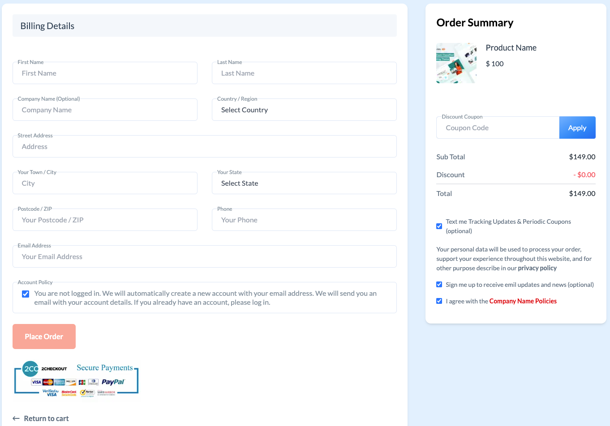

<a name="readme-top"></a>

> **NOTE**:
> Please note that this package is currently under development and not ready for production use. We are actively working on improving its functionality and addressing any issues. It is recommended to use it in development environment only and test it before using in production. We appreciate your patience and understanding while we work to improve the package.

<!-- PROJECT LOGO -->
<br />
<div align="center">
  <a href="#">
    
  </a>

  <h3 align="center">eCommerce Checkout Flow</h3>

  <p align="center">
    The checkout-flow package includes all necessary pages for a smooth checkout process: cart, checkout, thank you, and cancel pages.
    <br />
    <a href="#"><strong>Explore the docs »</strong></a>
    <br />
    <br />
    <a href="#">View Demo</a>
    ·
    <a href="https://github.com/js-template/checkout-flow/issues">Report Bug</a>
    ·
    <a href="https://github.com/js-template/checkout-flow/issues">Request Feature</a>
  </p>
</div>

<!-- TABLE OF CONTENTS -->
<details>
  <summary>Table of Contents</summary>
  <ol>
    <li>
      <a href="#about-the-project">About The Project</a>
      <ul>
        <li><a href="#built-with">Built With</a></li>
      </ul>
    </li>
    <li>
      <a href="#getting-started">Getting Started</a>
      <ul>
        <li><a href="#installation">Installation</a></li>
      </ul>
    </li>
    <li><a href="#usage">Usage</a></li>
    <!-- <li><a href="#roadmap">Roadmap</a></li> -->
    <li><a href="#contributing">Contributing</a></li>
    <!-- <li><a href="#license">License</a></li>
    <li><a href="#contact">Contact</a></li> -->
    <li><a href="#acknowledgments">Acknowledgments</a></li>
  </ol>
</details>

<!-- ABOUT THE PROJECT -->

## About The Project

  <a href="#">
    
  </a>

The checkout-flow package is here to help streamline your checkout process. It includes all necessary pages such as the cart, checkout, thank you, and cancel pages. These pages are designed to provide an easy and smooth user experience for your customers. Additionally, the package includes helpful features such as form validation and cart management to ensure a secure and efficient checkout process. This is a first version, it may have some bugs or limitations but it will help you to get started with your checkout process. The package is built with flexibility in mind, allowing for easy customization to match your brand and design. Give checkout-flow a try and see how it can improve your customer's checkout experience.

<p align="right">(<a href="#readme-top">back to top</a>)</p>

<!-- GETTING STARTED -->

## Getting Started

This is an example of how you may give instructions on setting up your project locally.
To get a local copy up and running follow these simple example steps.

### Prerequisites

This is an example of how to list things you need to use the software and how to install them.

- npm
  ```sh
  npm install npm@latest -g
  ```

### Installation

Installing the checkout-flow package is easy and straightforward. If you're using npm, simply run the following command in your terminal:

```sh
npm i @jstemplate/checkout-flow
```

If you're using yarn, the command will be:

```sh
yarn add @jstemplate/checkout-flow
```

That's it! The package will now be installed and ready for use in your project. You can then import the package and use its components in your code. Please make sure that you have latest version of npm or yarn installed in your system."

<!-- USAGE EXAMPLES -->

## Usage

Once the checkout-flow package is installed, you can start using it in your project. Here is an example of how to import the CheckOut component and use it in your code:

```jsx
import { CheckOut } from "@jstemplate/checkout-flow";

function YourComponent() {
  const [loading, setLoading] = useState(false);
  const [summaryData, setSummaryData] = useState({});
  const [cartData, setCartData] = useState([]);
  const [userData, setUserData] = useState({});
  const [loggedIn, setLoggedIn] = useState(false);

  const onSubmit = (data) => {
    // handle form submit
  };

  return (
    <CheckOut
      loading={loading}
      formSubmit={onSubmit}
      summeryData={summaryData}
      cartData={cartData}
      userData={userData}
      autoFill
      userLogin={loggedIn}
    />
  );
}
```

In this example, we import the CheckOut component from the checkout-flow package and use it in a functional component. We also set up some state variables to be passed as props to the CheckOut component. The loading prop is used to display a loading spinner while the form is being submitted, the formSubmit prop is a callback function to handle the form submission, the summeryData, cartData, and userData props are used to display the order summary, cart items, and user information respectively, the autoFill prop is used to automatically fill the form fields if the user is logged in, the userLogin prop is used to check the user login status.
Please make sure that you have the necessary data to pass to the component as props.

<p align="right">(<a href="#readme-top">back to top</a>)</p>

<!-- CONTRIBUTING -->

## Contributing

We welcome and appreciate any contributions to the checkout-flow package. Whether it's a bug fix or a new feature, your help makes this package better. If you have an idea that you think would improve this package, please feel free to fork the repository and create a pull request or open an issue with the tag "enhancement". Also, don't forget to give the project a star!

To contribute:

1. Fork the repository
2. Create a new branch for your feature (git checkout -b feature/[feature-name])
3. Commit your changes (git commit -m '[feature-name]: added/fixed/updated')
4. Push to your branch (git push origin feature/[feature-name])

Thank you for your support!"

<p align="right">(<a href="#readme-top">back to top</a>)</p>

<!-- LICENSE -->

## License

Distributed under the MIT License. See `LICENSE.txt` for more information.

<p align="right">(<a href="#readme-top">back to top</a>)</p>

## Acknowledgments

We would like to acknowledge and thank the following open-source projects and libraries for their contributions to the checkout-flow package:

- react
- react-dom
- react-hook-form
- react-icons
- react-loading-skeleton
- react-toast-notifications
- typescript

also icon from <a href="https://www.flaticon.com/free-icons/shopping-cart" title="shopping cart icons">Shopping cart icons created by Flat Icons - Flaticon</a>

These packages and libraries were essential for the development of the checkout-flow package and we are grateful for the hard work and dedication of their developers and contributors."

Content assistance provided by OpenAI's GPT-3 (ChatGPT)

<p align="right">(<a href="#readme-top">back to top</a>)</p>

<!-- MARKDOWN LINKS & IMAGES -->
<!-- https://www.markdownguide.org/basic-syntax/#reference-style-links -->
